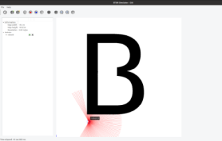

# Intelligent Robotics - Follow a B-shape Obstacle

This project presents a simple reactive robot that will contour a B-Shape Object

## Compile

### Setup

To compile and run this project it is necessary to install de [STDL simulator](http://wiki.ros.org/stdr_simulator). 

Just use the **environment_setup.sh** script and if necessary install **Qt4 dependencies**. 

To run this script first create a folder or give permissions to create directories and files.

### Compile commands (manual)

Open a terminal and go to the folder were the source code is and run the commands:

catkin_make

source devel/setup.bash

## Qt4 Dependencies

The [STDL simulator](http://wiki.ros.org/stdr_simulator) and the Ubuntu 20.04 LTS with ROS Noetic hasn't installed Qt4 libraries by default.

If your machine doen't have Qt4 dev installed, please run the following commands.

sudo add-apt-repository ppa:rock-core/qt4

sudo apt update

sudo apt-get install libqt4-dev

[Information source](https://www-icode9-com.translate.goog/content-3-978636.html?_x_tr_sl=auto&_x_tr_tl=en&_x_tr_hl=pt-PT&_x_tr_pto=nui#google_vignette)

# Run 

The simlation has different maps and robots with diferent sensors. Each simulation hypothesis has its own map and algortihm:

To start a map: 

>> roslaunch stdr_launchers "map to lauch"

To start a robot:

>> rosrun followb followb "robot" "sensor" "algorithm"

## Parallel Algorithm Wall Following

Start a robot with laser sensor in map inside of the b-shape obstacle

>> roslaunch stdr_launchers b_map_laser_in.launch

*on another terminal:*

>> rosrun followb followb robot0 laser pwall

***

Start a robot with laser sensor in map outside of the b-shape obstacle

>> roslaunch stdr_launchers b_map_laser_out.launch

*on another terminal:*

>> rosrun followb followb robot0 laser pwall

***

Start a robot with sonar sensor in map outside of the b-shape obstacle

>> roslaunch stdr_launchers b_map_sonar_out.launch
 
*on another terminal:*

>> rosrun followb followb robot0 sonar pwall

***

Start a robot with sonar sensor in map inside of the b-shape obstacle

>> roslaunch stdr_launchers b_map_sonar_in.launch

*on another terminal:*

>> rosrun followb followb robot0 sonar pwall

## Virtual Triangle Wall Following algorithm

Start a robot with laser sensor in map inside of the b-shape obstacle

>> roslaunch stdr_launchers b_map_laser_in.launch

*on another terminal:* 

>> rosrun followb followb robot0 laser vwall

***

Start a robot with laser sensor in map outside of the b-shape obstacle

>> roslaunch stdr_launchers b_map_laser_out.launch

*on another terminal:*

>> rosrun followb followb robot0 laser vwall
